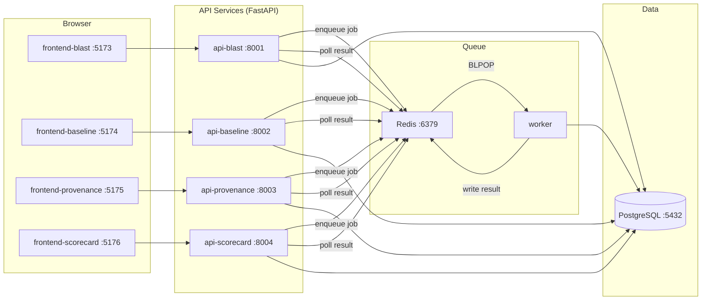
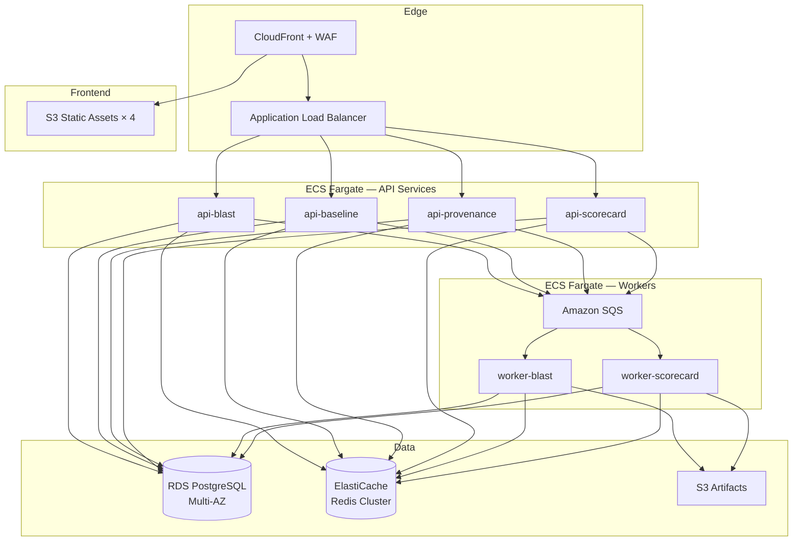

<div align="center">


<br/><br/>


<br/><br/>

# 🐠 Koi Security Extensions

**Enterprise AI agent security tooling for the Palo Alto Networks Koi platform.**

Four tools that map agent blast radius, detect behavioral anomalies, audit AI-generated code, and gate MCP server trust — deployable as a local POC in minutes or scaled to AWS for production multi-tenant use.

[Blast Radius](https://www.perplexity.ai/computer/a/koi-blast-radius-visualizer-r2Pz6fQdT0yzaXS2Ne7Lsg) · [Behavior Baseline](https://www.perplexity.ai/computer/a/koi-behavior-baseline-monitor-S8UY.9XZQ9aq52ZOwYZE3A) · [Code Provenance](https://www.perplexity.ai/computer/a/koi-code-provenance-tracker-n49zbDo3R0uEZ.B_LzebaQ) · [MCP Scorecard](https://www.perplexity.ai/computer/a/koi-mcp-trust-scorecard-3hfsJodeRKSzLa9PeUpZ2g)

</div>

---

## What This Is

AI agents are operating across enterprise infrastructure at a scale that existing security tooling wasn't designed to handle. They hold credentials, traverse databases, call external APIs, and write code — often with permissions far exceeding what their actual function requires.

Koi Security Extensions provides four purpose-built instruments for that problem:

| | Tool | Question It Answers |
|---|---|---|
| 🔴 | **Blast Radius Visualizer** | What can this agent reach if it's compromised right now? |
| 🟡 | **Behavior Baseline Monitor** | Is this agent behaving differently than it was last week? |
| 🟣 | **Code Provenance Tracker** | Who wrote this code, and does it have security issues? |
| 🔵 | **MCP Trust Scorecard** | Should we trust this MCP server enough to connect our agents to it? |

Each tool runs independently. Together they form a continuous AI security posture layer that integrates with **Palo Alto Networks Prisma AIRS** and **Cortex XDR**.

---

## Operating Models

This repo supports two deployment envelopes. The code is identical in both — only the runtime infrastructure changes.

### Local POC Model
> Evaluate the full suite on a developer machine in under 5 minutes using Docker Compose.

- Single `docker compose up --build` starts all services
- Full topology: frontend × 4, API × 4, worker, PostgreSQL, Redis
- Both API keys (Gemini, AbuseIPDB) are optional — apps degrade gracefully
- Scans run synchronously by default; async mode mirrors enterprise behavior

### Enterprise Scale Model
> AWS-first reference architecture for internet-facing, multi-tenant production deployment.

- Stateless API services on ECS Fargate behind ALB + CloudFront
- Async scan processing via SQS + ECS worker tasks
- PostgreSQL on RDS Multi-AZ, Redis on ElastiCache cluster
- Frontend assets on S3 + CloudFront with aggressive caching
- WAF, mTLS, OIDC auth, per-tenant isolation, full observability stack

See [docs/ENTERPRISE_ARCHITECTURE.md](./docs/ENTERPRISE_ARCHITECTURE.md) for the full AWS reference.

---

## Quick Start — Local POC

```bash
git clone https://github.com/BB-AI-Arena/MCP-Trust-Scoreboard.git
cd MCP-Trust-Scoreboard

cp .env.example .env
# Optionally add GEMINI_API_KEY and ABUSEIPDB_API_KEY — both are optional

docker compose up --build
```

First build takes 3–5 minutes. Once running:

| App | URL |
|---|---|
| Blast Radius Visualizer | http://localhost:5173 |
| Behavior Baseline Monitor | http://localhost:5174 |
| Code Provenance Tracker | http://localhost:5175 |
| MCP Trust Scorecard | http://localhost:5176 |

For detailed setup, troubleshooting, and port map — see [docs/LOCAL_POC.md](./docs/LOCAL_POC.md).

---

## Architecture

### Local POC Topology



### Enterprise AWS Topology



---

## Project Structure

```
koi-security-extensions/
├── shared/
│   ├── design-tokens.js              # Shared UI color/typography tokens
│   └── job_queue.py                  # Redis queue helper (local) / SQS adapter (enterprise)
├── app1-blast-radius/
│   ├── frontend/                      # React + Vite  :5173  |  Dockerfile + nginx.conf
│   └── backend/                       # FastAPI        :8001  |  Dockerfile
│       ├── graph_builder.py           # NetworkX directed graph + BFS reach scoring
│       ├── risk_scorer.py             # Blast radius 0–100, path analysis
│       └── gemini_analyzer.py         # Attack narrative + mitigations
├── app2-behavior-baseline/
│   ├── frontend/                      # React + Vite  :5174  |  Dockerfile + nginx.conf
│   └── backend/                       # FastAPI        :8002  |  Dockerfile
│       ├── mock_data.py               # 30-day seeded behavioral data, 5 agents
│       ├── baseline_engine.py         # Mean/stddev baseline builder
│       ├── anomaly_detector.py        # Z-score detection, 6 anomaly types
│       └── gemini_analyzer.py         # Cluster classification
├── app3-code-provenance/
│   ├── frontend/                      # React + Vite  :5175  |  Dockerfile + nginx.conf
│   └── backend/                       # FastAPI        :8003  |  Dockerfile
│       ├── provenance_detector.py     # 40-pattern heuristic AI model attribution
│       ├── code_risk_scanner.py       # 21-rule security vulnerability scanner
│       └── gemini_analyzer.py         # APPROVE / REVIEW / REJECT verdict
├── app4-mcp-scorecard/
│   ├── frontend/                      # React + Vite  :5176  |  Dockerfile + nginx.conf
│   └── backend/                       # FastAPI        :8004  |  Dockerfile
│       ├── domain_checker.py          # AbuseIPDB domain threat intel
│       ├── scorer.py                  # 6-dimension weighted scoring engine
│       └── gemini_analyzer.py         # Tool definition intent analysis
├── worker/
│   ├── worker.py                      # Async scan job processor (Redis BLPOP)
│   ├── requirements.txt
│   └── Dockerfile
├── docs/
│   ├── LOCAL_POC.md                   # Local setup, ports, scan flow, troubleshooting
│   └── ENTERPRISE_ARCHITECTURE.md    # AWS reference architecture, scaling, security
├── docker-compose.yml                 # Local POC orchestration
├── .env.example
└── README.md
```

---

## Stack

| Layer | Technology |
|---|---|
| Frontend | React 18, Tailwind CSS 3, Vite 5, Nginx (containerized) |
| Backend | FastAPI, Python 3.10+, uvicorn |
| Async HTTP | httpx |
| Job Queue | Redis (local) → SQS (enterprise) |
| AI Analysis | Google Gemini 2.0 Flash (`google-generativeai`) |
| Threat Intel | AbuseIPDB `/v2/check` |
| Graph Visualization | D3.js v7 (force-directed, treemap) |
| Charts | Recharts |
| Code Highlighting | highlight.js (Atom One Dark) |
| PDF Export | jsPDF + html2canvas |
| Graph Computation | NetworkX |
| Numerical Analysis | NumPy |
| Containerization | Docker, Docker Compose |

---

## Running Without Docker

If you prefer to run services directly:

```bash
cp .env.example .env

# Backend (4 terminals)
cd app1-blast-radius/backend   && pip install -r requirements.txt && cp ../../.env .env && uvicorn main:app --reload --port 8001
cd app2-behavior-baseline/backend && pip install -r requirements.txt && cp ../../.env .env && uvicorn main:app --reload --port 8002
cd app3-code-provenance/backend   && pip install -r requirements.txt && cp ../../.env .env && uvicorn main:app --reload --port 8003
cd app4-mcp-scorecard/backend     && pip install -r requirements.txt && cp ../../.env .env && uvicorn main:app --reload --port 8004

# Worker (optional — scans fall back to sync mode if Redis is unavailable)
cd worker && pip install -r requirements.txt && cp ../.env .env && python worker.py

# Frontend (4 more terminals)
cd app1-blast-radius/frontend   && npm install && npm run dev -- --port 5173
cd app2-behavior-baseline/frontend && npm install && npm run dev -- --port 5174
cd app3-code-provenance/frontend   && npm install && npm run dev -- --port 5175
cd app4-mcp-scorecard/frontend     && npm install && npm run dev -- --port 5176
```

Sync fallback: if Redis is not running, the MCP Scorecard API automatically falls back to synchronous inline processing. The other three APIs also support `SCAN_MODE=sync`.

---

## API Reference

### Scan Modes

All API services support two scan modes:

```http
# Synchronous — runs inline, returns result immediately
POST /scan

# Asynchronous — enqueues job, returns job_id
POST /scan/enqueue
GET  /jobs/{job_id}    # poll until status = "complete"
```

### App 1 — Blast Radius (`:8001`)

```http
POST /analyze
{ "agent_name": "GPT-4 Code Assistant", "permissions": ["read_files", "write_files"], "integrations": ["github", "s3"], "endpoint_type": "code" }
```

### App 2 — Behavior Baseline (`:8002`)

```http
GET  /agents
GET  /baseline/{agent_id}
GET  /anomalies/{agent_id}
GET  /summary/{agent_id}
POST /ingest   { "agent_id": "claude-code", "metric": "api_call_rate", "value": 450, "timestamp": "..." }
```

### App 3 — Code Provenance (`:8003`)

```http
POST /scan          { "code": "...", "language": "python", "filename": "utils.py" }
POST /scan-repo     multipart/form-data  file=@repo.zip
GET  /languages
```

### App 4 — MCP Scorecard (`:8004`)

```http
POST /scan          { "url": "https://mcp-server.example.com/manifest.json" }
POST /scan/enqueue  { "url": "..." }           # async mode
GET  /jobs/{job_id}                             # poll result
GET  /health
```

---

## Roadmap to Enterprise

The local POC and enterprise models are the same product in different envelopes. Here's how each local component maps forward:

| Local | Enterprise (AWS) | Migration Notes |
|---|---|---|
| `docker compose` | ECS task definitions | Dockerfiles already present |
| `postgres` container | RDS PostgreSQL Multi-AZ | `DATABASE_URL` env var, no code changes |
| `redis` container | ElastiCache Redis Cluster | `REDIS_URL` env var, no code changes |
| `worker` container | ECS Fargate + SQS consumer | Swap Redis BLPOP for SQS long-poll in `worker.py` |
| `api-*` containers | ECS Fargate services behind ALB | Add auth middleware, structured logging |
| `frontend-*` containers | S3 + CloudFront | `npm run build` output → S3 deploy |
| `.env` file | AWS Secrets Manager | Inject via ECS task secrets |

Full architecture details in [docs/ENTERPRISE_ARCHITECTURE.md](./docs/ENTERPRISE_ARCHITECTURE.md).

---

## Enterprise Integration

### Prisma AIRS
- Block `Untrusted` MCP servers from agent runtime connections
- Enforce agent permission caps derived from blast radius scores
- Auto-quarantine agents with `DataExfiltration` behavioral classification

### Cortex XDR
- Anomaly alerts → XDR incidents with MITRE ATT&CK tactic mapping
- Code Provenance `REJECT` verdicts → threat indicators for the file hash
- Blast Radius `Catastrophic` scores → asset risk context on the endpoint record

### CI/CD Gate Pattern

```
PR opened               → Code Provenance /scan
                            risk > Medium  → block merge
                            REJECT verdict → auto-close PR

Agent deployment        → Blast Radius /analyze
                            score > 75     → require manual approval

MCP server onboarding   → MCP Scorecard /scan
                            trust < Medium → reject integration

Agent runtime           → Behavior Baseline /ingest  (streaming)
                            anomaly detected → POST to Cortex XDR
```

---

## Documentation

| Document | Description |
|---|---|
| [docs/LOCAL_POC.md](./docs/LOCAL_POC.md) | Local setup, port map, scan flow, troubleshooting |
| [docs/ENTERPRISE_ARCHITECTURE.md](./docs/ENTERPRISE_ARCHITECTURE.md) | AWS reference architecture, scaling strategy, security hardening |

---

## Contributing

Pull requests are welcome. For major changes, open an issue first.

**Code conventions:**
- Python: type hints on all public functions; graceful degradation required for all external API calls
- JSX: Tailwind classes only, no inline styles
- All Gemini prompts must return `ONLY valid JSON` with fallback parsing
- New endpoints must support both sync and async scan modes

---

## License

MIT © 2026

---

<div align="center">
<sub>Built as an extension layer for <strong>Palo Alto Networks Koi Agentic Endpoint Security</strong> · Integrates with Prisma AIRS and Cortex XDR</sub>
</div>
