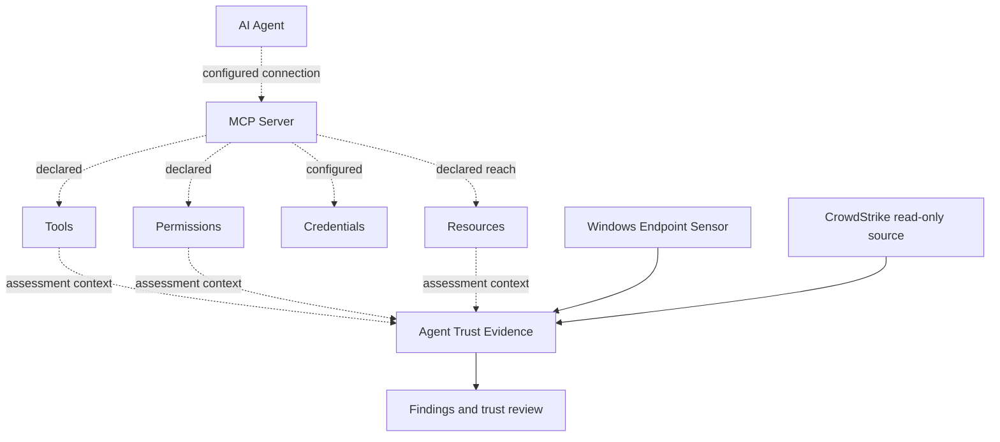
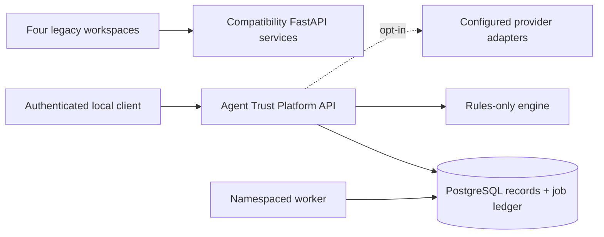

# MCP Trust Scoreboard

### Open-source MCP Security Dashboard for the Model Context Protocol

MCP Trust Scoreboard helps developers and security teams assess Model Context
Protocol (MCP) servers, MCP tools, MCP permissions, identity, network references
and trust evidence. Its MCP trust score supports MCP security review within
Agent Trust Platform, which extends evidence and correlation across AI agents,
endpoints, repositories, cloud resource declarations and existing security tools.

**MCP Trust Scoreboard is the MCP Security Dashboard from Agent Trust Platform.**

[**MCP Security Overview**](#secure-the-connection-between-ai-agents-and-tools) ·
[**Quick Start**](#quick-start) ·
[**MCP Trust Score**](#mcp-trust-score) ·
[**Architecture**](#architecture) ·
[**Roadmap**](docs/ROADMAP.md)

[](#release-status)
[](LICENSE)
[](https://github.com/BB-AI-Arena/MCP-Trust-Scoreboard/actions/workflows/ci.yml)


## Secure the connection between AI agents and tools

MCP connects AI agents to tools and resources. Model Context Protocol security
starts with making those connections reviewable: which MCP servers are configured,
who claims to publish them, what tools they expose, which permissions they request,
what resources those permissions could reach, and which destinations they reference.
MCP server security also depends on the evidence supporting trust and any supported
links to agents, endpoints and security findings.

Use the dashboard for MCP server assessment and MCP governance reviews: inspect
submitted declarations, review risk findings and identify missing evidence before
making an access decision. Configured access is a claim, independent verification
needs supporting evidence, and observed activity requires telemetry. These are
separate states; a declared permission is not evidence that a tool was used.

## MCP trust score

The scorecard presents a **Trust Score** from 0–100, six dimension explanations,
**Risk Findings** (flags), and a downloadable PDF report. The existing
[scoring implementation](app4-mcp-scorecard/backend/scorer.py) uses these dimensions:

| Dimension | Weight | Current assessment inputs |
| --- | --- | --- |
| Network | 25% | Domain references extracted from submitted JSON; resolution and AbuseIPDB results when configured, with missing-check notes. This does not observe network traffic. |
| Permissions | 20% | Declared permission count relative to tool count, with a penalty from optional analysis or its fallback suspicion value. This does not verify effective authorization. |
| Identity | 20% | Publisher/author/vendor name and declared identity or URL signals. A URL or submitted `verified` flag is not independent publisher verification. |
| Transparency | 15% | Source/repository, license and audit fields. Submitted audit claims are not independently checked. |
| Version | 10% | Version/history/changelog fields and declared undocumented permission changes. This is a metadata heuristic, not a comparison of collected snapshots. |
| Community | 10% | Submitted publication date, install/download counts and CVE references. No registry or vulnerability feed is collected by this dimension. |

**Evidence and assessment limitations:** the legacy scorecard primarily evaluates
supplied fields. Missing provider checks appear in notes/flags; fallback numbers
can still affect the score. A high score, absent flags or an AI suspicion value
does not establish security or a calibrated probability. Review the underlying
evidence and unavailable checks alongside the score.

**Recommendations for review:** confirm publisher and audit claims, narrow
unnecessary permissions, review referenced destinations and document version
changes. These are review steps, not automated remediation.

## MCP security capabilities

| Capability | Status | What it means |
| --- | --- | --- |
| MCP manifest assessment | Current | Upload a JSON object or fetch a JSON manifest URL for field-based analysis; no MCP handshake or tool execution. |
| MCP config evidence | Current, scoped Windows sensor | Discover metadata from supported, explicitly scoped MCP JSON configurations. This does not enumerate tools over the protocol. |
| MCP trust scoring | Current | Six weighted dimensions, overall score, explanations, flags and PDF export in the MCP dashboard. |
| Permission analysis | Current | Manifest permission/tool-count heuristic; optional Gemini analysis requires configuration and hosted-analysis opt-in. |
| Domain/network references | Current | Extract HTTP(S) host references from JSON; optional AbuseIPDB-backed checks. References do not establish actual connections. |
| Identity/publisher signals | Current | Assess submitted names, URLs and identity claims; independent publisher verification is not supplied by the scorecard. |
| Findings and evidence | Current, separate surfaces | Scorecard flags/report; platform API stores normalized evidence and findings from supported sources. Scorecard submissions are not automatically a unified platform evidence graph. |
| Agent/resource context | Current, bounded | Declared-access graph, scoped endpoint correlations and explicit agent mappings for external findings. No complete observed MCP tool-use graph. |

### Current, planned and future

- **CURRENT:** manifest/config/evidence-based analysis, the existing MCP trust score
  and dashboard, plus available Agent Trust evidence correlation through the
  platform API and supported connectors.
- **PLANNED:** actual MCP stdio discovery, Streamable HTTP MCP discovery, OpenAPI
  collection and a tested protocol compatibility matrix
  ([ATP-B1](https://github.com/BB-AI-Arena/MCP-Trust-Scoreboard/issues/10)); expanded
  verification, evidence snapshots and drift
  ([ATP-B2](https://github.com/BB-AI-Arena/MCP-Trust-Scoreboard/issues/7)).
- **FUTURE:** broader runtime MCP monitoring, an MCP Trust Registry concept, and
  expanded policy/optional enforcement. The registry is a direction, not an
  implemented service or committed release milestone. See the
  [roadmap](docs/ROADMAP.md) for behavioral baselines/SDKs (ATP-C2), graph/artifact
  views (ATP-E1), release operations (ATP-D1) and optional enforcement (ATP-F1).

There is no shipped live MCP protocol scanning. Scoped endpoint configuration
discovery is not an implementation of ATP-B1.

## Quick start

```bash
git clone https://github.com/BB-AI-Arena/MCP-Trust-Scoreboard.git
cd MCP-Trust-Scoreboard
python3 scripts/configure_local.py
docker compose config --format json | python3 scripts/validate_deployment.py
docker compose up --build -d --wait
```

After startup, open **http://localhost:5176** for the MCP assessment dashboard.
The stack also starts the three companion workspaces, platform API, workers and
storage listed below.

Fresh installations need Python 3.11+ and Docker Engine with Compose v2+.
The generator creates a private `.env` with random local credentials and refuses
to overwrite an existing file. **For an existing installation, retain its database
credentials and volumes**; replace only placeholder API tokens with a new random
token. Changing `POSTGRES_PASSWORD` does not change an initialized database's password.
See [upgrade, backup and rollback](docs/ALPHA_ACCEPTANCE.md#installation-and-data).

All published ports bind to loopback; PostgreSQL/Redis have no host ports. The
four legacy workspaces are unauthenticated local demonstrations. Do not expose
them through a public proxy, tunnel, or nonlocal port override. Only the modular
API supports scoped authentication; remote deployment needs an intentional
override, trusted TLS proxy and security review. This is not enterprise readiness.

The Compose stack preserves the existing Postgres/Redis volume names and
environment aliases. Redis is retained for legacy compatibility only; the
namespaced platform API uses PostgreSQL durable records and a PostgreSQL job
ledger. Redis is not the source of truth and cache loss does not recover
expired results.

| Service | URL |
| --- | --- |
| MCP Trust Scoreboard / MCP Security Dashboard | http://localhost:5176 |
| Agent Access / Blast Radius | http://localhost:5173 |
| Behavior Baseline Monitor | http://localhost:5174 |
| Artifact Assurance | http://localhost:5175 |
| Agent Trust Platform API | http://127.0.0.1:8080 |

The platform API requires `AGENT_TRUST_API_TOKEN` and binds all records to the
server-configured `AGENT_TRUST_WORKSPACE_ID`; submitted workspace fields are
not trusted. Rules run without provider credentials. Hosted analysis requires
both an explicitly configured provider and `AGENT_TRUST_HOSTED_ANALYSIS=true`.

### Assess an MCP manifest

1. Open **http://localhost:5176**. Save the illustrative JSON below as
   `mcp-example.json`, or use your own assessment manifest.
2. Drop the file into **Drop manifest JSON here** and select **Analyze MCP Server**.
3. Review the overall score, six dimensions, flags and missing-provider notes;
   use **Export PDF** to retain the report.

```json
{
  "name": "example-local-docs",
  "version": "0.1.0",
  "publisher": {"name": "Example development team"},
  "tools": [{"name": "read_docs", "description": "Read project documentation"}],
  "permissions": ["files:read:docs"]
}
```

This is illustrative input for the current field-based scorer, not a standard
MCP protocol manifest or a client launch configuration. Uploading arbitrary
`mcpServers`/`servers` configuration objects does not normalize them into this
scorecard format. The URL field fetches JSON; it does not connect to an MCP
transport endpoint.

**No CrowdStrike account, Windows sensor, webhook destination or provider API key
is required for this assessment.** Missing Gemini/domain intelligence is reported
as unavailable/skipped in the result; loading animations are not proof that a
provider ran. The Windows sensor, CrowdStrike and webhook setup linked below are
optional integrations for additional platform evidence or finding delivery.

## MCP security is only one part of Agent Trust

Agent Trust Platform is the broader umbrella for AI agent security. It adds
Windows endpoint evidence, Shadow AI context, process/network/file metadata,
durable PostgreSQL evidence and jobs, a read-only CrowdStrike source, webhook
finding delivery and bounded agent/resource correlation. Cloud resources in the
access workspace are declarations; they are not proof of live cloud inventory.
Broader security integrations remain future work.

Agent Trust can correlate MCP and AI-agent context with endpoint security evidence
from products such as CrowdStrike. External security platforms are complementary
evidence sources. Explicit mappings and temporal co-presence do not establish
that an AI agent caused an external finding or accessed a particular file.

### Windows endpoint sensor — current

The native Go Windows sensor supports per-device enrollment, DPAPI-protected
credentials, process/TCP/file metadata, software/OS inventory, scoped AI/MCP
configuration discovery and a persistent offline spool. Endpoint evidence and
findings flow through the platform API/worker. Least-privilege Windows Service
acceptance passed on Windows Server 2022 under a virtual service account,
including enrollment, offline recovery and credential persistence.

It is **observe-only**: no process/network blocking, quarantine, DLP enforcement
or MCP tool execution. Service-account collector visibility can be degraded or
permission-limited; foreground discovery does not prove service visibility.
There is no Windows client certification claim and no macOS/Linux sensor yet.
See [Windows setup and limits](docs/endpoint/WINDOWS.md),
[service acceptance](docs/endpoint/SERVICE_ACCEPTANCE.md) and
[metadata privacy](docs/endpoint/PRIVACY.md).

### CrowdStrike — current read-only connector

The [CrowdStrike Falcon connector](docs/connectors/CROWDSTRIKE.md) uses
**Hosts READ** and **Alerts READ** for endpoint context and vendor-origin findings,
with revision tracking and optional delivery through the existing webhook path.
It is **read-only and fixture-tested**, including local TLS and real PostgreSQL
pipeline tests. Live tenant/production validation remains pending. It performs
**no containment, no RTR and no response execution**.

## Architecture

This is a conceptual evidence map. Dashed links describe assessment context and
possible relationships, not observed execution or implemented protocol collection.
Credentials are an access concern here; the diagram does not imply credential
contents are collected. Endpoint/external evidence enters through separate sources.



### MCP trust graph concept

**Agent → MCP Server → Tool → Permission → Resource**, with links where supported
to **Endpoint Evidence → External Security Finding**, is the review model.
The current access graph uses declarations; endpoint correlations are bounded and
external findings use explicit mappings. A unified graph with all these edges is
planned, not an observed relationship map available today.

The platform evidence model distinguishes `claimed`, `verified`, `observed`,
`unavailable` and `not_applicable`. Configured access remains claimed unless
appropriate verification or observation supports a stronger statement. Declared
access must never be presented as actual use. See the
[evidence model](src/agent_trust/domain/models.py) and
[technical plan](docs/TECHNICAL_PLAN.md).

### Runtime layout



The namespaced package lives under `src/agent_trust/` with `api`, `domain`,
`engines`, `adapters`, `providers`, `storage`, `security`, and `jobs` modules.
Gemini and AbuseIPDB are optional adapters retained behind explicit
interfaces. An OpenAI-compatible adapter supports configured hosted or local
endpoints, but compatibility does not imply identical model behavior.

## Four workspaces

The four legacy workspaces and their existing routes remain available for
compatibility. MCP is the primary repository entry point; the other workspaces
extend the review context without completing the planned platform views.

| Workspace | Security question | Capability today |
| --- | --- | --- |
| **MCP / Tool & Connector Trust** | What evidence supports a connection decision? | Manifest scorecard, domain references, permission signals and PDF report. |
| **Agent Access / Blast Radius** | What could an agent reach under declared permissions? | Interactive declared-permission graph and attack paths; no observed authorization claim. |
| **Behavior Monitoring** | Which supplied metrics differ from the current baseline? | Legacy baseline/anomaly demonstration and event contract; seeded data is labeled. Broader learned baselines and SDKs remain ATP-C2. |
| **Code and Artifact Assurance** | What evidence supports an artifact decision? | Static checks and labeled heuristic/provider provenance signals; expanded evidence views remain ATP-E1. |

The React/D3/Recharts views on ports 5173–5176 are local compatibility
demonstrations. Heuristic attribution and optional provider output retain their
limitations: a heuristic is not proof of authorship, and a signed build alone
does not establish code security.

## Platform API

The versioned API is under `/api/v1`:

```text
GET  /health             GET  /readiness          GET  /version
GET  /api/v1/capabilities
GET/POST /api/v1/agents              GET/POST /api/v1/connections
GET/POST /api/v1/events              GET/POST /api/v1/findings
GET/POST /api/v1/graphs               GET/POST /api/v1/assessments
GET  /api/v1/jobs/{job_id}
GET  /api/v1/connectors              GET /api/v1/evidence
POST /api/v1/connectors/generic-json/events
```

Assessment submission returns `202 Accepted` and a durable job ID. Jobs are
at-least-once, lease-based, bounded-retry work. Workers claim rows with
PostgreSQL `FOR UPDATE SKIP LOCKED`; lease tokens fence stale workers. Clients
must provide idempotency keys for retried submissions. The API uses bounded
pagination (`limit` 1–100), structured errors, bearer authentication, and
scoped capabilities (`read`, `write`, `assess`).

The [reference connector path](docs/CONNECTORS.md) accepts authenticated JSON,
persists normalized evidence and rule findings, and delivers findings to an
explicitly configured webhook through durable retryable jobs. Evidence sources,
finding destinations and response authority are separate: delivery is not
enforcement. Tested with real local HTTP/TLS endpoints, not live vendor services.

## Release status

**Alpha candidate: 2.0.0-alpha.1 — ready for maintainer review for publication.**
The implementation stack is merged and merged-main alpha validation passed.
**No release has been published.**

[Release preparation on main `4465d69`](https://github.com/BB-AI-Arena/MCP-Trust-Scoreboard/actions/runs/34741080865)
passed after the status-documentation merge. See
[implementation status](docs/IMPLEMENTATION_STATUS.md) and
[stack reconciliation](docs/STACK_RECONCILIATION.md) for the source-bound evidence
and accepted limits. Publication remains a separate maintainer decision.
Known dependency CVEs remain accepted/informational for alpha; hardening is
deferred. This is not a production-hardening or enterprise-readiness claim.

## Development

```bash
python3 -m venv .venv
. .venv/bin/activate
python -m pip install -e '.[postgres,test]'
pytest
python -m compileall -q src tests
for d in app1-blast-radius/frontend app2-behavior-baseline/frontend app3-code-provenance/frontend app4-mcp-scorecard/frontend; do (cd "$d" && npm ci && npm run build); done
docker compose config
```

Run [full runtime/browser/security acceptance](docs/ALPHA_ACCEPTANCE.md) before
considering a release. Those gates include real PostgreSQL, installed containers,
browser downloads, backup/restore and container SBOM/scans. Known dependency CVEs
are [accepted for development/alpha; hardening deferred](docs/KNOWN_SECURITY_ISSUES.md).
Alpha is not production-hardened. Scanner execution, functional/data-integrity
checks and maintainer review remain required; green unit tests alone are insufficient.

The test suite uses disposable SQLite databases only as a fast contract test;
production and Compose configuration target PostgreSQL. Tests cover provider
absence, idempotency, record persistence, lease recovery/fencing,
workspace authorization, private URLs, and unsafe ZIP archives. The actual
MCP/OpenAPI protocol collectors, authenticated telemetry SDKs, and enforcement
gateway are later roadmap work.

## Security and limitations

- Do not execute submitted source, manifest tools, or OpenAPI operations.
- URL collectors must use allowlists, TLS validation, bounded timeouts, and
  explicit scope for private targets; automatic cross-origin credential
  forwarding is not supported.
- `claimed`, `verified`, `observed`, `unavailable`, and `not_applicable`
  evidence states remain distinct; missing information stays unknown. Confidence
  is not a calibrated probability.
- Demo seed data is available only in the legacy behavior workspace and is not
  a production telemetry source.
- This alpha candidate does not claim universal access, shared multi-tenant isolation,
  automatic quarantine, or live vendor production validation.

See [docs/TECHNICAL_PLAN.md](docs/TECHNICAL_PLAN.md),
[docs/ROADMAP.md](docs/ROADMAP.md), [docs/LOCAL_POC.md](docs/LOCAL_POC.md), and
[docs/ENTERPRISE_ARCHITECTURE.md](docs/ENTERPRISE_ARCHITECTURE.md).

## License

This repository’s original code and documentation are available under the
[MIT License](LICENSE). You may use, copy, modify, distribute, sublicense, and
sell it, provided that the copyright and license notices are retained. It is
provided without warranty.

Third-party dependencies, fonts, icons, fixtures, and externally supplied
content remain subject to their own licenses and notices. The MIT license does
not grant rights to third-party names, services, or data.
