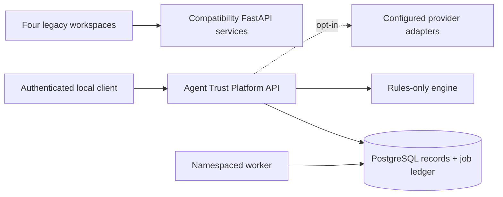

# Agent Trust Platform

Agent Trust Platform is a vendor-neutral security assessment and monitoring
platform for AI agents. It is currently a single-tenant, local/self-hosted
alpha. The project keeps the original repository URL and four working legacy
workspaces while introducing a namespaced migration API.

## Four workspaces

| Workspace | Question | Existing local flow |
| --- | --- | --- |
| Tool and Connector Trust | What should be trusted before an agent connects? | MCP manifest scorecard |
| Agent Access / Blast Radius | What can an agent reach under declared permissions? | Permission graph |
| Behavior Monitoring | Is observed activity outside its baseline? | Metric ingestion and anomaly detection |
| Code and Artifact Assurance | What security evidence exists for an artifact? | Static checks and provenance signals |

The existing React/D3/Recharts visualizations and FastAPI routes remain
available on ports 5173–5176. They are compatibility demonstrations: seeded
behavior data, heuristic attribution, and optional provider output are labeled
as such. A heuristic is not proof of authorship, and a signed build is not
proof that code is safe.

## Quick start

```bash
git clone https://github.com/BB-AI-Arena/MCP-Trust-Scoreboard.git
cd MCP-Trust-Scoreboard
cp .env.example .env
docker compose up --build
```

The Compose stack preserves the existing Postgres/Redis volume names and
environment aliases. Redis is retained for legacy compatibility only; the
namespaced platform API uses PostgreSQL durable records and a PostgreSQL job
ledger. Redis is not the source of truth and cache loss does not recover
expired results.

| Service | URL |
| --- | --- |
| Blast Radius Visualizer | http://localhost:5173 |
| Behavior Baseline Monitor | http://localhost:5174 |
| Artifact Assurance | http://localhost:5175 |
| Tool and Connector Trust | http://localhost:5176 |
| Agent Trust Platform API | http://127.0.0.1:8080 |

The platform API requires `AGENT_TRUST_API_TOKEN` and binds all records to the
server-configured `AGENT_TRUST_WORKSPACE_ID`; submitted workspace fields are
not trusted. Rules run without provider credentials. Hosted analysis requires
both an explicitly configured provider and `AGENT_TRUST_HOSTED_ANALYSIS=true`.

## Platform API

The versioned API is under `/api/v1`:

```text
GET  /health             GET  /readiness          GET  /version
GET  /api/v1/capabilities
GET/POST /api/v1/agents              GET/POST /api/v1/connections
GET/POST /api/v1/events              GET/POST /api/v1/findings
GET/POST /api/v1/graphs               GET/POST /api/v1/assessments
GET  /api/v1/jobs/{job_id}
```

Assessment submission returns `202 Accepted` and a durable job ID. Jobs are
at-least-once, lease-based, bounded-retry work. Workers claim rows with
PostgreSQL `FOR UPDATE SKIP LOCKED`; lease tokens fence stale workers. Clients
must provide idempotency keys for retried submissions. The API uses bounded
pagination (`limit` 1–100), structured errors, bearer authentication, and
scoped capabilities (`read`, `write`, `assess`).

## Architecture



The namespaced package lives under `src/agent_trust/` with `api`, `domain`,
`engines`, `adapters`, `providers`, `storage`, `security`, and `jobs` modules.
Gemini and AbuseIPDB are optional adapters retained behind explicit
interfaces. An OpenAI-compatible adapter supports configured hosted or local
endpoints, but compatibility does not imply identical model behavior.

## Development

```bash
python3 -m venv .venv
. .venv/bin/activate
python -m pip install -e '.[postgres,test]'
pytest
python -m compileall -q src tests
for d in app1-blast-radius/frontend app2-behavior-baseline/frontend app3-code-provenance/frontend app4-mcp-scorecard/frontend; do (cd "$d" && npm ci && npm run build); done
docker compose config
```

The test suite uses disposable SQLite databases only as a fast contract test;
production and Compose configuration target PostgreSQL. Tests cover provider
absence, idempotency, record persistence, lease recovery/fencing,
workspace authorization, private URLs, and unsafe ZIP archives. The actual
MCP/OpenAPI protocol collectors, authenticated telemetry SDKs, and enforcement
gateway are later roadmap work.

## Security and limitations

- Do not execute submitted source, manifest tools, or OpenAPI operations.
- URL collectors must use allowlists, TLS validation, bounded timeouts, and
  explicit scope for private targets; automatic cross-origin credential
  forwarding is not supported.
- Unknown, unavailable, claimed, observed, and verified evidence are distinct
  states. Confidence is not a calibrated probability.
- Demo seed data is available only in the legacy behavior workspace and is not
  a production telemetry source.
- This release does not claim universal access, shared multi-tenant isolation,
  automatic quarantine, or completed proprietary integrations.

See [docs/TECHNICAL_PLAN.md](docs/TECHNICAL_PLAN.md),
[docs/ROADMAP.md](docs/ROADMAP.md), [docs/LOCAL_POC.md](docs/LOCAL_POC.md), and
[docs/ENTERPRISE_ARCHITECTURE.md](docs/ENTERPRISE_ARCHITECTURE.md).

## License

MIT. Copyright and attribution from the original project are preserved.
