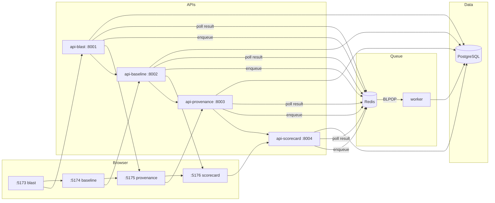

<div align="center">


<br/>


<br/><br/>

# 🐠 Koi Security Extensions

### AI Agent Security for the Palo Alto Networks Koi Platform

Blast radius mapping · Behavioral anomaly detection · AI code provenance · MCP server trust scoring

Runs locally with a single command. Scales to AWS for production multi-tenant deployment.

<br/>

[**Blast Radius →**](https://www.perplexity.ai/computer/a/koi-blast-radius-visualizer-r2Pz6fQdT0yzaXS2Ne7Lsg) &nbsp;·&nbsp; [**Behavior Baseline →**](https://www.perplexity.ai/computer/a/koi-behavior-baseline-monitor-S8UY.9XZQ9aq52ZOwYZE3A) &nbsp;·&nbsp; [**Code Provenance →**](https://www.perplexity.ai/computer/a/koi-code-provenance-tracker-n49zbDo3R0uEZ.B_LzebaQ) &nbsp;·&nbsp; [**MCP Scorecard →**](https://www.perplexity.ai/computer/a/koi-mcp-trust-scorecard-3hfsJodeRKSzLa9PeUpZ2g)

</div>

---

## Overview

AI agents now hold credentials, traverse databases, call external APIs, and write code — often with permissions that no human operator approved or reviewed. Existing EDR and SIEM platforms were not designed for this surface area.

Koi Security Extensions is a suite of four instruments built to close that gap:

| | Tool | Security Question |
|---|---|---|
| 🔴 | [**Blast Radius Visualizer**](#app-1--blast-radius-visualizer) | What is the full damage scope if this agent is compromised? |
| 🟡 | [**Behavior Baseline Monitor**](#app-2--behavior-baseline-monitor) | Is this agent deviating from its established behavioral profile? |
| 🟣 | [**Code Provenance Tracker**](#app-3--code-provenance-tracker) | Who — or what model — wrote this code, and is it safe to ship? |
| 🔵 | [**MCP Trust Scorecard**](#app-4--mcp-trust-scorecard) | Is this MCP server trustworthy enough for agent integration? |

Each tool is independently deployable. Together they form a continuous AI security posture layer on top of the Koi platform, with direct integration paths to **Prisma AIRS** and **Cortex XDR**.

---

## Quick Start

```bash
git clone https://github.com/BB-AI-Arena/MCP-Trust-Scoreboard.git
cd MCP-Trust-Scoreboard

cp .env.example .env        # add API keys — both optional, apps degrade gracefully

docker compose up --build   # starts all 10 services
```

| Service | URL |
|---|---|
| Blast Radius Visualizer | http://localhost:5173 |
| Behavior Baseline Monitor | http://localhost:5174 |
| Code Provenance Tracker | http://localhost:5175 |
| MCP Trust Scorecard | http://localhost:5176 |

First build: ~3–5 min. Subsequent starts: ~30 seconds.
Full setup guide → [docs/LOCAL_POC.md](./docs/LOCAL_POC.md)

---

## Operating Models

The same codebase supports two deployment envelopes. Infrastructure changes; application code does not.

| | Local POC | Enterprise Scale |
|---|---|---|
| **Orchestration** | Docker Compose | ECS Fargate + ALB |
| **Database** | PostgreSQL container | Amazon RDS (Multi-AZ) |
| **Cache / Queue** | Redis container | ElastiCache + SQS |
| **Worker** | Python process | ECS Fargate task (SQS consumer) |
| **Frontend** | Nginx container | S3 + CloudFront |
| **Secrets** | `.env` file | AWS Secrets Manager |
| **Startup** | `docker compose up` | CI/CD → ECS rolling deploy |
| **Docs** | [LOCAL_POC.md](./docs/LOCAL_POC.md) | [ENTERPRISE_ARCHITECTURE.md](./docs/ENTERPRISE_ARCHITECTURE.md) |

---

## The Four Tools

### App 1 — Blast Radius Visualizer

Input an AI agent's permissions and integrations. Get a force-directed graph of every system, credential, database, and API it can reach — scored 0–100 with a Contained → Catastrophic rating. Gemini generates a plain-English attack narrative and three concrete mitigations.

| | |
|---|---|
| **Backend** | NetworkX directed graph (7 node types, 4 edge types), BFS transitive reach scoring |
| **AI** | Gemini attack narrative: "If this agent were compromised, an attacker could…" |
| **Frontend** | D3.js v7 force graph — draggable nodes, zoom/pan, fly-in animation, slide-in NodePanel |
| **Export** | PDF report via jsPDF + html2canvas |

### App 2 — Behavior Baseline Monitor

Establishes statistical behavioral baselines for AI agents across five metrics and flags deviations using Z-score detection. Pre-loaded with 30 days of seeded data for five agents (Claude Code, Copilot, Cursor, AutoGPT, Custom Agent). Gemini classifies anomaly clusters as DataExfiltration, LateralMovement, PrivilegeEscalation, or BenignDrift.

| | |
|---|---|
| **Detection** | Z-score (threshold: 2.5σ) across API call rate, file access, network destinations, execution time, active hours |
| **Anomaly types** | NewDomain, FileSpike, CredentialAccess, OffHoursActivity, ExecutionTimeSpike, NewAPIEndpoint |
| **AI** | Gemini cluster classification with confidence score and recommended action |
| **Frontend** | Recharts baseline chart with ±1σ confidence band, 24×7 SVG activity heatmap, live anomaly feed |

### App 3 — Code Provenance Tracker

Attributes code to a specific AI model using 40 heuristic pattern rules — no external API call needed for detection. Runs a parallel 21-rule security scanner. Gemini issues an APPROVE / REVIEW / REJECT verdict with remediations. Supports paste, file upload, and zip repo scan.

| | |
|---|---|
| **Attribution** | Claude · GPT-4 · Gemini · Copilot · Human · Unknown — confidence scored 0–100 |
| **Security rules** | Hardcoded secrets, SQL injection, eval/exec, shell injection, unsafe deserialization, overly broad permissions, deprecated crypto |
| **AI** | Gemini APPROVE / REVIEW / REJECT with remediation checklist |
| **Frontend** | D3.js treemap (files colored by model), highlight.js viewer with inline finding annotations |

### App 4 — MCP Trust Scorecard

Analyzes any MCP server manifest — by URL or raw JSON — and produces a weighted trust score across six security dimensions. AbuseIPDB checks every domain. Gemini analyzes tool definitions for suspicious intent and permission overreach.

| Dimension | Weight | Scoring Logic |
|---|---|---|
| Network Behavior | 25% | −20 per flagged domain, −10 per unresolvable |
| Permission Sprawl | 20% | −15 per permission exceeding 3× tool count |
| Identity | 20% | Verified org = 90, named = 60, anonymous = 25 |
| Code Transparency | 15% | Audited = 95, source only = 50, none = 20 |
| Version Drift | 10% | Stable = 85, silent perm add = 20, no history = 50 |
| Community Signal | 10% | −20 if age < 30d · −20 if installs < 100 · −30 if CVEs |

**Trust ratings:** `High` (80–100) · `Medium` (60–79) · `Low` (40–59) · `Untrusted` (0–39)

---

## Architecture

### Local POC



### Enterprise AWS

```mermaid
graph TB
    subgraph Edge
        CF[CloudFront + WAF]
        ALB[ALB]
    end
    subgraph Static
        S3[S3 — frontend assets]
    end
    subgraph Control["ECS Fargate — APIs"]
        A1[api-blast] & A2[api-baseline] & A3[api-provenance] & A4[api-scorecard]
    end
    subgraph Async["ECS Fargate — Workers"]
        SQS[SQS scan-jobs]
        W[worker tasks]
    end
    subgraph Data
        RDS[(RDS PostgreSQL\nMulti-AZ)]
        EC[(ElastiCache\nRedis Cluster)]
        S3A[S3 artifacts]
    end
    CF --> S3
    CF --> ALB --> A1 & A2 & A3 & A4
    A1 & A2 & A3 & A4 --> SQS --> W
    A1 & A2 & A3 & A4 & W --> RDS & EC
    W --> S3A
```



Full reference → [docs/ENTERPRISE_ARCHITECTURE.md](./docs/ENTERPRISE_ARCHITECTURE.md)

---

## Tech Stack

| Layer | Technology |
|---|---|
| **Frontend** | React 18 · Tailwind CSS 3 · Vite 5 · Nginx |
| **Backend** | FastAPI · Python 3.10+ · uvicorn · httpx |
| **AI analysis** | Google Gemini 2.0 Flash |
| **Threat intel** | AbuseIPDB |
| **Job queue** | Redis (local) → SQS (enterprise) |
| **Graph visualization** | D3.js v7 — force-directed, treemap |
| **Charts** | Recharts |
| **Code highlighting** | highlight.js (Atom One Dark) |
| **PDF export** | jsPDF + html2canvas |
| **Graph computation** | NetworkX |
| **Numerical analysis** | NumPy |
| **Containerization** | Docker · Docker Compose |

---

## Repo Structure

```
koi-security-extensions/
├── shared/
│   ├── design-tokens.js          # UI color + typography tokens
│   └── job_queue.py              # Redis queue helper → SQS-compatible schema
├── app1-blast-radius/
│   ├── frontend/                  # :5173  Dockerfile + nginx.conf
│   └── backend/                   # :8001  Dockerfile
│       ├── graph_builder.py       # NetworkX graph + BFS reach scoring
│       ├── risk_scorer.py         # Blast radius 0–100 + path analysis
│       └── gemini_analyzer.py     # Attack narrative + mitigations
├── app2-behavior-baseline/
│   ├── frontend/                  # :5174  Dockerfile + nginx.conf
│   └── backend/                   # :8002  Dockerfile
│       ├── mock_data.py           # 30-day seeded behavioral data, 5 agents
│       ├── baseline_engine.py     # Mean/stddev baseline builder
│       ├── anomaly_detector.py    # Z-score detection, 6 anomaly types
│       └── gemini_analyzer.py     # Cluster classification
├── app3-code-provenance/
│   ├── frontend/                  # :5175  Dockerfile + nginx.conf
│   └── backend/                   # :8003  Dockerfile
│       ├── provenance_detector.py # 40-pattern heuristic AI attribution
│       ├── code_risk_scanner.py   # 21-rule vulnerability scanner
│       └── gemini_analyzer.py     # APPROVE / REVIEW / REJECT
├── app4-mcp-scorecard/
│   ├── frontend/                  # :5176  Dockerfile + nginx.conf
│   └── backend/                   # :8004  Dockerfile
│       ├── domain_checker.py      # AbuseIPDB domain threat intel
│       ├── scorer.py              # 6-dimension weighted scoring
│       └── gemini_analyzer.py     # Tool definition intent analysis
├── worker/
│   ├── worker.py                  # Redis BLPOP job processor
│   ├── requirements.txt
│   └── Dockerfile
├── docs/
│   ├── LOCAL_POC.md               # Setup, port map, scan flow, troubleshooting
│   └── ENTERPRISE_ARCHITECTURE.md # AWS reference, scaling, security hardening
├── docker-compose.yml
├── .env.example
└── README.md
```

---

## API Reference

All services support synchronous and asynchronous scan modes:

```http
POST /scan              # sync — returns result inline
POST /scan/enqueue      # async — returns { job_id, status: "queued" }
GET  /jobs/{job_id}     # poll for result
GET  /health            # liveness probe
```

| Service | Port | Key Endpoints |
|---|---|---|
| Blast Radius | 8001 | `POST /analyze` |
| Behavior Baseline | 8002 | `GET /agents` · `GET /anomalies/{id}` · `GET /summary/{id}` · `POST /ingest` |
| Code Provenance | 8003 | `POST /scan` · `POST /scan-repo` · `GET /languages` |
| MCP Scorecard | 8004 | `POST /scan` · `POST /scan/enqueue` · `GET /jobs/{id}` |

---

## Roadmap to Enterprise

| Local Component | AWS Target | Migration Notes |
|---|---|---|
| `postgres` container | RDS PostgreSQL Multi-AZ | Set `DATABASE_URL` — zero code changes |
| `redis` container | ElastiCache Redis Cluster | Set `REDIS_URL` — zero code changes |
| `worker` container | ECS Fargate + SQS consumer | Swap Redis BLPOP for SQS long-poll in `worker.py` |
| `api-*` containers | ECS Fargate behind ALB | Add auth middleware + structured logging |
| `frontend-*` containers | S3 + CloudFront | `npm run build` → S3 deploy, CloudFront invalidation |
| `.env` file | AWS Secrets Manager | Inject via ECS task secrets |

---

## Enterprise Integration

### Prisma AIRS
- Block `Untrusted` MCP servers at agent runtime
- Enforce agent permission caps from blast radius analysis
- Auto-quarantine on `DataExfiltration` behavioral classification

### Cortex XDR
- Anomaly alerts → XDR incidents with MITRE ATT&CK tactic mapping
- Code Provenance `REJECT` verdicts → threat indicators on file hash
- Blast Radius `Catastrophic` → asset risk context on endpoint record

### CI/CD Gate

```
PR opened         → /scan (Code Provenance)   risk > Medium   → block merge
Agent deploy      → /analyze (Blast Radius)   score > 75      → require approval
MCP onboarding    → /scan (MCP Scorecard)      rating < Medium → reject
Agent runtime     → /ingest (Behavior)         anomaly         → Cortex XDR incident
```

---

## Documentation

| | |
|---|---|
| [docs/LOCAL_POC.md](./docs/LOCAL_POC.md) | Local setup, port map, scan flow, env vars, troubleshooting |
| [docs/ENTERPRISE_ARCHITECTURE.md](./docs/ENTERPRISE_ARCHITECTURE.md) | AWS reference architecture, scaling strategy, security hardening, Azure/GCP notes |

---

## Contributing

Pull requests are welcome. For significant changes, open an issue first.

- Python: type hints on all public functions; all external API calls must degrade gracefully
- JSX: Tailwind only, no inline styles
- Gemini prompts must request `ONLY valid JSON` and include a fallback parse path

---

## License

MIT © 2026

---

<div align="center">
<sub>Built as an extension layer for <strong>Palo Alto Networks Koi Agentic Endpoint Security</strong><br/>Integrates with Prisma AIRS · Cortex XDR</sub>
</div>
