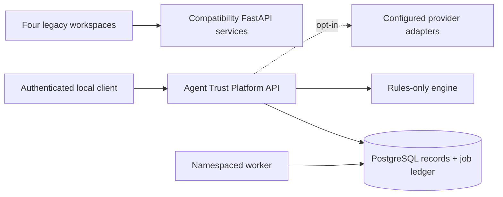

<div align="center">


<a href="LICENSE"></a>
<a href="https://github.com/BB-AI-Arena/MCP-Trust-Scoreboard/actions/workflows/ci.yml"></a>


<br/>


<br/><br/>

# 🛡️ Agent Trust Platform

### Vendor-neutral security assessment and monitoring for AI agents

Permission reach · Connector trust · Behavior signals · Artifact assurance

Single-tenant, local/self-hosted alpha software for understanding what agents
can access, what they actually do, and what evidence supports trust decisions.

<br/>

[**Explore the workspaces ↓**](#four-workspaces) &nbsp;·&nbsp;
[**Quick start →**](#quick-start) &nbsp;·&nbsp;
[**Technical plan →**](docs/TECHNICAL_PLAN.md)

</div>

---

## Make agent access reviewable

AI agents are becoming capable of reading sensitive data, invoking tools, and
crossing service boundaries. Agent Trust Platform gives security and platform
teams one local-first place to inspect that access, test trust assumptions, and
retain the evidence behind an assessment.

| Before deployment | During operation | During review |
| --- | --- | --- |
| Understand declared permissions, integrations, and connector risk. | Compare observed activity with an agent’s expected behavior. | Preserve findings, evidence, artifact signals, and deterministic decisions. |

The product is designed for teams that need a practical security workbench
before they are ready to send sensitive agent data to a shared SaaS service.
It runs on a single-tenant local or self-hosted deployment, starts with
rules-only analysis, and makes optional provider use explicit.

## Four workspaces

| | Workspace | Security question | Capability today |
| --- | --- | --- | --- |
| 🔵 | **Tool and Connector Trust** | What should be trusted before an agent connects? | Manifest scorecard, domain checks, permission signals |
| 🟣 | **Agent Access / Blast Radius** | What can an agent reach under declared permissions? | Interactive permission graph and attack paths |
| 🟢 | **Behavior Monitoring** | Is observed activity outside its baseline? | Baseline metrics, anomaly detection, event contract |
| 🟠 | **Code and Artifact Assurance** | What evidence supports an artifact decision? | Static security checks and clearly labeled provenance signals |

### Capabilities at a glance

| Capability | Available in this alpha | Boundary |
| --- | --- | --- |
| Rules-first assessment | Yes | Deterministic findings run without API keys. |
| Agent access mapping | Yes | Current graph inputs are declared permissions and integrations; observed authorization is a roadmap item. |
| Durable state and jobs | Yes | PostgreSQL is the durable target; Redis remains a legacy compatibility cache. |
| Provider adapters | Yes | Optional Gemini, OpenAI-compatible, and AbuseIPDB adapters expose explicit unavailable states. |
| Evidence model | Foundation | Versioned evidence fields exist; broader collector coverage is in the next milestone. |
| Live MCP/OpenAPI discovery | Planned | No submitted tool or operation is executed by default. |
| Inline enforcement | Planned for 2.1 | This alpha assesses and observes; it does not quarantine or block requests. |

The existing React/D3/Recharts visualizations and FastAPI routes remain
available on ports 5173–5176. They are compatibility demonstrations: seeded
behavior data, heuristic attribution, and optional provider output are labeled
as such. A heuristic is not proof of authorship, and a signed build is not
proof that code is safe.

## Built for security and platform teams

- **Security engineering** gets a repeatable way to review agent reach,
  connector exposure, findings, and evidence without depending on a hosted
  control plane.
- **Platform engineering** gets a versioned API, PostgreSQL-backed records,
  fenced jobs, scoped capabilities, and compatibility routes for incremental
  adoption.
- **Application and agent owners** get a visual assessment workflow that turns
  a permission list into understandable paths, risks, and mitigations.

The product’s core promise is deliberately concrete: make access and trust
assumptions visible, preserve uncertainty instead of inventing confidence, and
keep deterministic policy decisions separate from optional model analysis.

## Why this architecture

```text
Declared access ──┐
Observed events ───┼──> Evidence ──> Assessment ──> Reviewable findings
Artifacts ────────┘          │             │
                             └──> Graph / behavior / assurance views
```

- **Vendor-neutral:** adapters declare whether they assess, inventory,
  observe, or enforce; no closed-product integration is implied by a name.
- **Local-first:** loopback defaults, scoped bearer auth, redaction controls,
  bounded requests, and explicit hosted-data opt-in are part of the baseline.
- **Operationally durable:** PostgreSQL stores records and the job ledger;
  leases, fencing, idempotency, and bounded retries make recovery behavior
  visible and testable.
- **Honest by design:** claimed, verified, observed, unavailable, and unknown
  states remain distinct. Confidence is not presented as a calibrated
  probability.

## Quick start

```bash
git clone https://github.com/BB-AI-Arena/MCP-Trust-Scoreboard.git
cd MCP-Trust-Scoreboard
cp .env.example .env
docker compose up --build
```

The Compose stack preserves the existing Postgres/Redis volume names and
environment aliases. Redis is retained for legacy compatibility only; the
namespaced platform API uses PostgreSQL durable records and a PostgreSQL job
ledger. Redis is not the source of truth and cache loss does not recover
expired results.

| Service | URL |
| --- | --- |
| Blast Radius Visualizer | http://localhost:5173 |
| Behavior Baseline Monitor | http://localhost:5174 |
| Artifact Assurance | http://localhost:5175 |
| Tool and Connector Trust | http://localhost:5176 |
| Agent Trust Platform API | http://127.0.0.1:8080 |

The platform API requires `AGENT_TRUST_API_TOKEN` and binds all records to the
server-configured `AGENT_TRUST_WORKSPACE_ID`; submitted workspace fields are
not trusted. Rules run without provider credentials. Hosted analysis requires
both an explicitly configured provider and `AGENT_TRUST_HOSTED_ANALYSIS=true`.

## Platform API

The versioned API is under `/api/v1`:

```text
GET  /health             GET  /readiness          GET  /version
GET  /api/v1/capabilities
GET/POST /api/v1/agents              GET/POST /api/v1/connections
GET/POST /api/v1/events              GET/POST /api/v1/findings
GET/POST /api/v1/graphs               GET/POST /api/v1/assessments
GET  /api/v1/jobs/{job_id}
```

Assessment submission returns `202 Accepted` and a durable job ID. Jobs are
at-least-once, lease-based, bounded-retry work. Workers claim rows with
PostgreSQL `FOR UPDATE SKIP LOCKED`; lease tokens fence stale workers. Clients
must provide idempotency keys for retried submissions. The API uses bounded
pagination (`limit` 1–100), structured errors, bearer authentication, and
scoped capabilities (`read`, `write`, `assess`).

## Architecture



The namespaced package lives under `src/agent_trust/` with `api`, `domain`,
`engines`, `adapters`, `providers`, `storage`, `security`, and `jobs` modules.
Gemini and AbuseIPDB are optional adapters retained behind explicit
interfaces. An OpenAI-compatible adapter supports configured hosted or local
endpoints, but compatibility does not imply identical model behavior.

## Development

```bash
python3 -m venv .venv
. .venv/bin/activate
python -m pip install -e '.[postgres,test]'
pytest
python -m compileall -q src tests
for d in app1-blast-radius/frontend app2-behavior-baseline/frontend app3-code-provenance/frontend app4-mcp-scorecard/frontend; do (cd "$d" && npm ci && npm run build); done
docker compose config
```

The test suite uses disposable SQLite databases only as a fast contract test;
production and Compose configuration target PostgreSQL. Tests cover provider
absence, idempotency, record persistence, lease recovery/fencing,
workspace authorization, private URLs, and unsafe ZIP archives. The actual
MCP/OpenAPI protocol collectors, authenticated telemetry SDKs, and enforcement
gateway are later roadmap work.

## Security and limitations

- Do not execute submitted source, manifest tools, or OpenAPI operations.
- URL collectors must use allowlists, TLS validation, bounded timeouts, and
  explicit scope for private targets; automatic cross-origin credential
  forwarding is not supported.
- Unknown, unavailable, claimed, observed, and verified evidence are distinct
  states. Confidence is not a calibrated probability.
- Demo seed data is available only in the legacy behavior workspace and is not
  a production telemetry source.
- This release does not claim universal access, shared multi-tenant isolation,
  automatic quarantine, or completed proprietary integrations.

See [docs/TECHNICAL_PLAN.md](docs/TECHNICAL_PLAN.md),
[docs/ROADMAP.md](docs/ROADMAP.md), [docs/LOCAL_POC.md](docs/LOCAL_POC.md), and
[docs/ENTERPRISE_ARCHITECTURE.md](docs/ENTERPRISE_ARCHITECTURE.md).

## License

This repository’s original code and documentation are available under the
[MIT License](LICENSE). You may use, copy, modify, distribute, sublicense, and
sell it, provided that the copyright and license notices are retained. It is
provided without warranty.

Third-party dependencies, fonts, icons, fixtures, and externally supplied
content remain subject to their own licenses and notices. The MIT license does
not grant rights to third-party names, services, or data.
