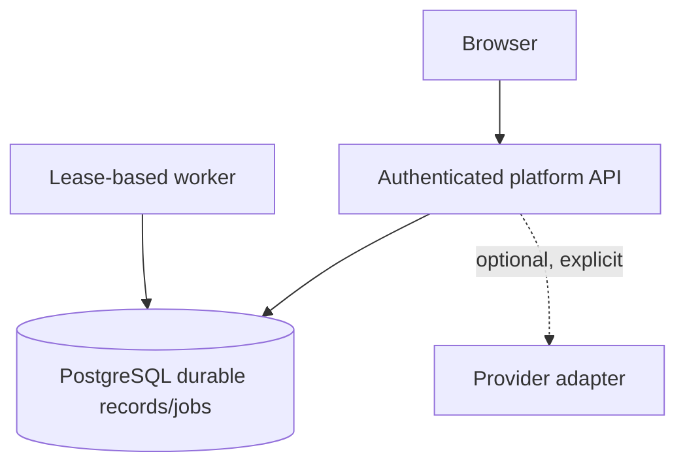

# Deployment boundary and future scale

This document records boundaries, not a claim that a shared SaaS deployment
exists. The current product target is one tenant per local/self-hosted
deployment. A production operator may place the API and worker behind an
approved network boundary, but multi-tenant isolation, universal IAM access,
automatic quarantine, and proprietary integrations are not shipped.

## Current topology

PostgreSQL is the system of record. Redis is not a durable queue for the new
API. The old four apps and Redis worker are compatibility services and should
be retired only after their route/response consumers migrate and the B-series
acceptance gates pass.

## Required hardening before a shared service

- Separate tenant keys and database authorization; test cross-tenant reads,
  writes, exports, logs, jobs, caches, and object storage adversarially.
- Use managed secret storage, key rotation, TLS, private networking, egress
  allowlists, DNS/redirect revalidation, and resource limits.
- Run database migrations with backups, restore drills, and a tested rollback
  path. Do not silently rename existing volumes or environment variables.
- Add authenticated collector identities and scoped credentials. Keep reported
  agent identity separate from the sender identity.
- Prove denied enforcement requests never reach an upstream before enabling
  the optional v2.1 gateway.

Cloud services such as RDS, managed Redis, object storage, or a queue are
deployment choices for an operator, not dependencies of this repository's
alpha. No paid infrastructure is provisioned by the project.
