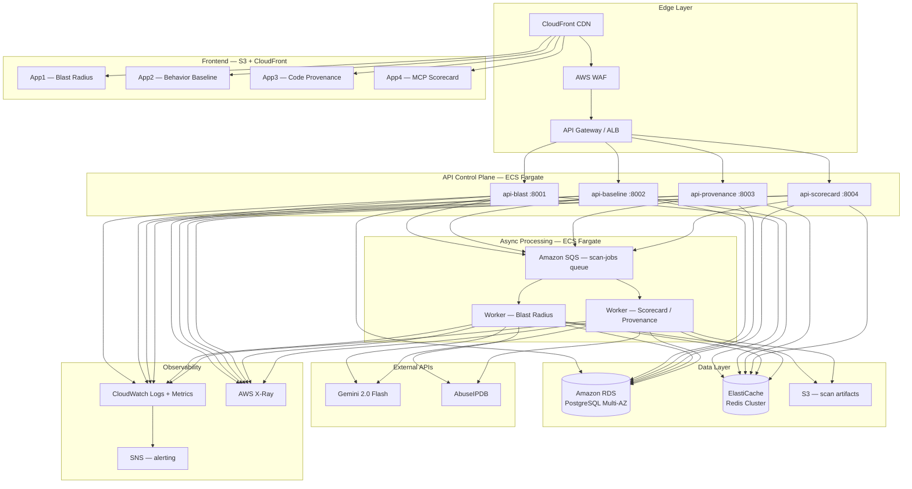

# Enterprise Scale Model

This document describes the target enterprise architecture for Koi Security Extensions. It is AWS-first. Azure and GCP deployment notes are included at the end for teams operating in those environments.

---

## Purpose

The enterprise model is designed for:

- **Multi-tenant SaaS** — isolated scan data per tenant, tenant-aware API routing
- **Internet-facing deployment** — hardened edge, rate limiting, WAF, auth
- **Horizontal scale** — stateless API and worker tiers that scale independently
- **Operational visibility** — structured logging, distributed tracing, metrics, alerting
- **Enterprise auth** — SSO/SAML via OIDC, per-tenant API keys, RBAC

The codebase is identical to the local POC. The operating envelope changes: Docker Compose → ECS/EKS, local Postgres → RDS, local Redis → ElastiCache, local worker → SQS-backed ECS task.

---

## Architecture Overview



---

## Component Responsibilities

### Edge Layer

| Component | Role |
|---|---|
| **CloudFront** | CDN for frontend assets, TLS termination, geo-routing |
| **AWS WAF** | Rate limiting, IP reputation, OWASP rule sets, bot protection |
| **ALB / API Gateway** | L7 routing to ECS services, health check integration, mTLS optional |

CloudFront distributions are per-app (one per frontend). A single ALB routes to all four API services via path-based rules (`/api/blast/*`, `/api/baseline/*`, etc.).

### Frontend — S3 + CloudFront

React builds are deployed as static assets to versioned S3 prefixes. CloudFront invalidations on deploy. No server-side rendering required — all four apps are fully static post-build.

Cache strategy:
- `index.html` — `Cache-Control: no-cache` (always fresh)
- `assets/*` — `Cache-Control: max-age=31536000, immutable` (content-hashed filenames)

### API Control Plane — ECS Fargate

Four stateless FastAPI services, one per tool. Each service:

- Validates and authenticates the incoming request (JWT / API key)
- Enqueues a scan job to SQS with a unique `job_id`
- Returns `{ "job_id": "...", "status": "queued" }` immediately
- Exposes `GET /scan/{job_id}` which reads from ElastiCache (hot) or RDS (cold)

Scaling: Target-tracking autoscaling on CPU (target 60%). Each service scales independently. Min 2 tasks per service for availability.

Task sizing: 0.5 vCPU / 1 GB RAM per task is sufficient for all four services under normal load. Burst to 2 vCPU / 4 GB for the provenance scanner under heavy repo scans.

### Async Processing — SQS + ECS Worker

Scan jobs are processed asynchronously by dedicated worker tasks. The worker:

1. Long-polls SQS (`WaitTimeSeconds=20`)
2. Deserializes the job payload
3. Runs the appropriate scoring pipeline (same Python modules as the API)
4. Calls Gemini and AbuseIPDB if keys are present
5. Writes the result to RDS and caches it in ElastiCache with TTL
6. Uploads any large artifacts (e.g., repo scan reports) to S3
7. Deletes the SQS message on success; lets it return to queue on failure (DLQ after 3 attempts)

Worker scaling: SQS `ApproximateNumberOfMessagesVisible` → Step scaling. Scale out aggressively (1 task per 5 messages), scale in conservatively (10-minute cooldown).

Dead Letter Queue: Messages that fail 3 times are routed to `koi-scan-jobs-dlq`. CloudWatch alarm triggers SNS notification to on-call.

### Data Layer

**Amazon RDS for PostgreSQL (Multi-AZ)**

Primary datastore for:
- Scan results (all four tools)
- Tenant registry
- Agent profiles and baseline history (App 2)
- Audit log

Use `db.t4g.medium` for POC migration, `db.r7g.xlarge` for production. Enable Performance Insights. Automated daily snapshots retained 30 days.

Schema is multi-tenant with a `tenant_id` column on all scan tables, enforced at the application query layer (not row-level security — that's a future hardening item).

**Amazon ElastiCache for Redis (Cluster Mode)**

Used for:
- Scan result cache (TTL: 1 hour for MCP scans, 24 hours for behavior baselines)
- Job status polling (`job_id` → status → result pointer)
- Rate limiting counters (per API key, per tenant)

`cache.r7g.large` with 2 shards for production. Encryption in transit and at rest.

**S3 — Scan Artifacts**

Large outputs (repo scan trees, full graph JSON for large blast radius analyses) are written to S3 and referenced by RDS record. Pre-signed URLs served to frontend via API. Lifecycle policy: move to S3-IA after 30 days, Glacier after 90.

---

## Auth and Multi-Tenancy

**Authentication:**
- API keys for programmatic access (CI/CD integrations, Cortex XDR webhooks)
- OIDC/SSO for the web UI (Okta, Azure AD, Google Workspace — any OIDC-compatible IdP)
- JWT access tokens, 1-hour TTL, refresh token rotation

**RBAC roles:**
- `viewer` — read scan results
- `scanner` — submit scans, read results
- `admin` — manage API keys, view all tenant data, configure integrations

**Multi-tenancy:**
- Every API request is authenticated to a tenant
- `tenant_id` is injected into all scan jobs and database writes
- Tenants are isolated at the application layer; cross-tenant queries are blocked by middleware
- Shared infrastructure (RDS, ElastiCache, SQS) with logical isolation — physical isolation available as an enterprise option

---

## Observability

| Layer | Tooling |
|---|---|
| Structured logs | CloudWatch Logs (JSON format, log groups per service) |
| Distributed tracing | AWS X-Ray (trace propagation across API → SQS → Worker) |
| Metrics | CloudWatch custom metrics + Container Insights |
| Dashboards | CloudWatch dashboards — scan throughput, p50/p95/p99 latency, error rate, queue depth |
| Alerting | CloudWatch Alarms → SNS → PagerDuty / Slack |
| Uptime | Route 53 health checks on ALB endpoints |

Key alarms:
- DLQ depth > 0 (any worker failure)
- API p99 latency > 5s
- Error rate > 1% over 5 minutes
- Worker SQS queue depth > 50 (processing backlog)
- RDS CPU > 80%

---

## Scaling Strategy

| Tier | Metric | Scale Out | Scale In |
|---|---|---|---|
| API services | CPU > 60% | +1 task | CPU < 30% for 10 min |
| Worker | SQS queue depth | +1 task per 5 messages | Queue empty for 10 min |
| RDS | Read replicas | Add read replica at CPU > 70% | Manual |
| ElastiCache | Memory > 70% | Increase node size | Manual |

All API services are stateless — scale out is immediate with no warm-up required. Worker tasks have a ~30-second cold start (Python import + model loading).

---

## Security Hardening

- All services run in private subnets; only the ALB has a public IP
- API keys and Gemini/AbuseIPDB credentials stored in AWS Secrets Manager, injected via ECS task secrets (never in environment variables in production)
- VPC endpoints for S3, SQS, and Secrets Manager (no traffic over public internet)
- CloudFront with WAF: rate limit 100 req/s per IP, OWASP managed rule group, geo-restriction configurable per tenant
- RDS: no public access, encrypted at rest (AES-256), TLS required for connections
- ECS tasks: read-only root filesystem, no privileged containers, non-root user
- Container images scanned with Amazon ECR image scanning on push

---

## Recommended AWS Services Summary

| Category | Service | Notes |
|---|---|---|
| Compute | ECS Fargate | Serverless containers, no cluster management |
| Container registry | Amazon ECR | Private registry, image scanning |
| Queue | Amazon SQS | Standard queue for scan jobs, FIFO optional |
| Database | Amazon RDS PostgreSQL | Multi-AZ, automated backups |
| Cache | Amazon ElastiCache Redis | Cluster mode, encryption in transit |
| Object storage | Amazon S3 | Artifacts, frontend assets |
| CDN | Amazon CloudFront | Frontend delivery, API caching optional |
| DNS | Amazon Route 53 | Health checks, latency-based routing |
| Secrets | AWS Secrets Manager | API keys, DB credentials |
| WAF | AWS WAF | Rate limiting, OWASP rules |
| Observability | CloudWatch, X-Ray | Logs, traces, metrics |
| CI/CD | GitHub Actions + ECR | Build, push, deploy on merge to main |

---

## CI/CD Pipeline

```
git push → GitHub Actions
  ├── Run tests (pytest, vitest)
  ├── Build Docker images
  ├── Push to ECR (tagged with git SHA)
  ├── Update ECS task definition
  └── Deploy to ECS (rolling update, min 50% healthy)
```

Zero-downtime rolling deployments. Rollback by repointing the ECS service to the previous task definition revision.

---

## Azure and GCP Notes

The architecture above is AWS-first. For teams in Azure or GCP, the service mapping is straightforward:

**Azure:**
- ECS Fargate → Azure Container Apps
- SQS → Azure Service Bus
- RDS → Azure Database for PostgreSQL
- ElastiCache → Azure Cache for Redis
- CloudFront → Azure Front Door
- Secrets Manager → Azure Key Vault
- ECR → Azure Container Registry

**GCP:**
- ECS Fargate → Cloud Run
- SQS → Cloud Pub/Sub
- RDS → Cloud SQL (PostgreSQL)
- ElastiCache → Memorystore for Redis
- CloudFront → Cloud CDN
- Secrets Manager → Secret Manager
- ECR → Artifact Registry

The application code is cloud-agnostic — only the infrastructure layer changes.
